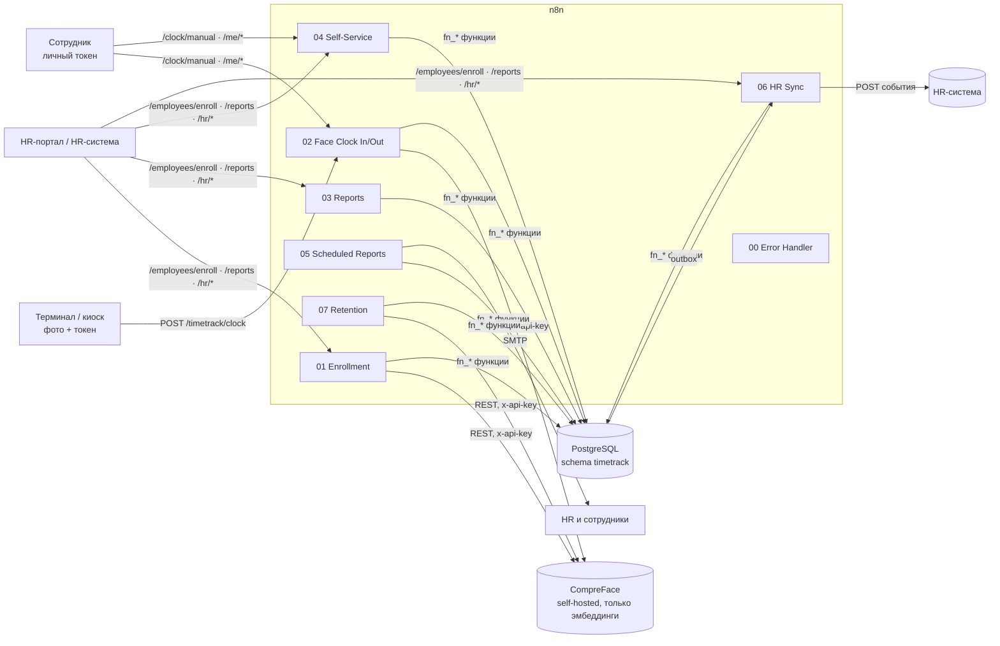

# Face Time Tracking — учёт рабочего времени по распознаванию лиц на n8n

Готовое решение «Time Management AI» на базе n8n: сотрудник отмечает приход и уход фотографией на терминале, система распознаёт лицо, безопасно записывает отметку в PostgreSQL, формирует табели и отчёты для HR, даёт сотруднику проверять и исправлять свои записи и синхронизируется с HR-системой.

Папка самодостаточна: воркфлоу импортируются в любой актуальный n8n (в этот форк и в облако), схема БД применяется одним файлом, стенд поднимается через `docker compose`.



## Что внутри

| Путь | Назначение |
|---|---|
| `workflows/*.json` | 8 воркфлоу n8n (импортируемые файлы), 146 нод |
| `scripts/workflows/*.mjs`, `scripts/lib/builder.mjs` | исходники воркфлоу: JSON собирается кодом (`node scripts/build-workflows.mjs`) |
| `scripts/validate-workflows.mjs` | проверка JSON: связи, типы и версии нод по исходникам n8n, параметры SQL |
| `db/001_schema.sql` | схема `timetrack`: таблицы, функции бизнес-логики, отчётные функции, outbox, retention |
| `db/003_calendar_absences.sql` | производственный календарь (праздники, переносы, предпраздничные дни) и отсутствия (отпуск, больничный, командировка) — применяется следом за схемой |
| `db/900_selftest.sql`, `scripts/test-db.sh` | самотест схемы (7 групп сценариев, откатывается) |
| `db/002_seed_demo.sql` | демо-сотрудники, токены и история для стенда |
| `docker-compose.yml`, `.env.example` | стенд: n8n + PostgreSQL + CompreFace |
| `docs/walkthrough.md`, `examples/` | разбор на примере одного рабочего дня: реальный прогон, ответы терминалу, отчёты, скриншот; `examples/run-demo.sh` воспроизводит всё одной командой |
| `docs/api.md` | контракты всех эндпоинтов |
| `docs/reports.md` | правила расчёта табеля и типы отчётов |
| `docs/hr-integration.md` | outbox, форматы событий, входящая синхронизация |
| `docs/privacy-compliance.md` | биометрия и закон: что реализовано, чек-лист внедрения |
| `docs/n8n-node-versions.md` | какие версии нод и почему |
| `HANDOFF.md` | контекст, решения, выводы и следующие шаги для продолжения работы |

## Воркфлоу

| # | Воркфлоу | Триггеры | Суть |
|---|---|---|---|
| 00 | Error Handler | Error Trigger | письмо администратору + запись в аудит при сбое любого воркфлоу |
| 01 | Employee Enrollment | `POST /timetrack/employees/enroll`, `POST /timetrack/biometrics/revoke` | карточка сотрудника + согласие + загрузка лица в CompreFace; отзыв и удаление биометрии |
| 02 | Face Clock In/Out | `POST /timetrack/clock`, `POST /timetrack/clock/manual` | распознавание, порог схожести, `fn_clock()` (согласие, антидребезг, чередование, идемпотентность), ручная отметка без биометрии |
| 03 | Attendance Reports | `GET /timetrack/reports` | standard / detailed / summary в json, csv, html; HR — все, сотрудник — только себя |
| 04 | Employee Self-Service | `GET /timetrack/me/records`, `POST /timetrack/me/corrections`, `GET /timetrack/hr/corrections`, `POST /timetrack/hr/corrections/review` | просмотр и корректировка своих записей, рассмотрение HR с уведомлениями |
| 05 | Scheduled Reports & Reminders | cron 1-го числа и по понедельникам | месячный табель HR (HTML + CSV), напоминания сотрудникам о проблемных днях |
| 06 | HR System Sync | cron каждые 15 мин, `POST /timetrack/hr/employees`, `/hr/absences`, `/hr/calendar` | доставка событий в HR-систему через outbox, приём справочника сотрудников, отпусков и производственного календаря |
| 07 | Data Retention | cron ежедневно | удаление биометрии уволенных/отозвавших согласие, очистка журналов |

## Быстрый старт (стенд)

```bash
cd face-time-tracking
cp .env.example .env                 # задайте TT_DB_PASSWORD и N8N_ENCRYPTION_KEY
docker compose up -d                 # n8n: http://localhost:5678, CompreFace: http://localhost:8000
docker compose logs postgres | grep -A6 token_kind   # демо-токены печатаются при инициализации БД
```

1. **CompreFace**: откройте http://localhost:8000, зарегистрируйтесь, создайте приложение и сервис типа *Recognition*, скопируйте его API-ключ.
2. **Credentials в n8n** (имена важны — воркфлоу ссылаются на них):
   * `Timetrack Postgres` — Postgres: host `postgres`, db `timetrack`, user/password из `.env`;
   * `CompreFace Recognition API Key` — Header Auth: name `x-api-key`, value — ключ из п. 1;
   * `Timetrack SMTP` — SMTP для писем HR и сотрудникам;
   * `HR System API` — Header Auth для приёмника событий (можно заглушку, если интеграции пока нет).
3. **Импорт воркфлоу**: `scripts/import-workflows.sh compose` (или через UI *Import from file*). В настройках каждого воркфлоу назначьте *Error Workflow* → «Timetrack 00 — Error Handler», проверьте ноды *Config* (адрес CompreFace, пороги, e-mail) и активируйте.
4. **Проверка**: `HR_TOKEN=… DEVICE_TOKEN=… EMPLOYEE_TOKEN=… ENROLL_PHOTO=a.jpg CLOCK_PHOTO=b.jpg scripts/smoke-test.sh` — регистрация, отметка, антидребезг, ручная отметка, корректировка, отчёты.

Для существующего n8n: примените `db/001_schema.sql` и `db/003_calendar_absences.sql` к своей PostgreSQL, поднимите CompreFace (официальный `docker-compose` проекта) и импортируйте `workflows/*.json`.

## Как это работает

**Отметка (воркфлоу 02).** Терминал шлёт multipart-фото и свой токен → `fn_authenticate` (токены хранятся как sha256) → снимок уходит в CompreFace *как binary*, не попадая в JSON → лучший результат сравнивается с `similarityThreshold` (0.9) → `fn_clock()` в одной транзакции проверяет статус сотрудника и действующее согласие, отбрасывает повторы (`request_id`, антидребезг 120 с), определяет тип события (чередование; забытый уход старше 16 ч не «закрывается» задним числом), пишет событие, аудит и outbox. В ответ терминал получает имя, тип и время отметки. Неуспешные попытки логируются без фото.

**Хранение.** Фото не сохраняются нигде — ни в БД, ни в n8n (при multipart), ни в CompreFace (`SAVE_IMAGES_TO_DB=false`). В событии остаются схожесть и sha256 снимка. Согласия версионируются, отзыв удаляет шаблон и блокирует распознавание; ручная отметка остаётся.

**Отчёты.** Вся математика в SQL (`fn_sessions` → `fn_daily_summary` → `fn_timesheet`): смены через полночь, автоудержание обеда, опоздания, ранние уходы, сверхурочные, прогулы и незакрытые смены. Праздники, переносы и предпраздничные дни берутся из производственного календаря, а отпуск, больничный и командировка — из таблицы отсутствий, поэтому они не превращаются в прогулы (см. `docs/reports.md`). Форматирование — общий JS-модуль, поэтому веб-отчёт и рассылка совпадают.

**Корректировки.** Сотрудник запрашивает `add`/`change`/`void` с причиной; HR одобряет или отклоняет; при одобрении создаётся новое событие `source = correction`, старое помечается `corrected`/`voided` — история не теряется; обе стороны получают письма.

## Настройка

* **Пороги и адреса** — ноды *Config* в каждом воркфлоу (`faceApiUrl`, `similarityThreshold`, `detProbThreshold`, `debounceSeconds`, `maxSessionHours`, e-mail адреса, `hrSystemUrl`, сроки хранения).
* **Графики работы** — `work_schedule` сотрудника: `{"start":"09:00","end":"18:00","days":[1,2,3,4,5],"break_minutes":60,"break_after_minutes":360}`; часовой пояс — IANA. Праздники и переносы — в производственном календаре (`calendar_code` сотрудника), отпуска и больничные — в отсутствиях.
* **Токены** — `SELECT timetrack.fn_issue_token('Kiosk 2', 'device', NULL, 'Цех 2');` (роли: `device`, `employee`, `hr`, `system`; можно задать `expires_at`). Отзыв: `UPDATE timetrack.api_clients SET active = false WHERE name = '…'`.
* **Другой провайдер распознавания** (AWS Rekognition, Azure Face, Luxand и т. п.) — замените ноды *Recognize Face* / *Register Face* / *Delete Face Templates* и адаптируйте разбор ответа в *Interpret Recognition*; остальная система от провайдера не зависит.

## Разработка и проверка

```bash
node scripts/build-workflows.mjs      # собрать workflows/*.json из scripts/workflows/*.mjs
node scripts/validate-workflows.mjs   # структурная проверка + типы/версии нод по packages/nodes-base
scripts/test-db.sh                    # схема + самотест + демо-данные на временном PostgreSQL (docker или DATABASE_URL)
```

Правило: правки воркфлоу вносятся в `scripts/workflows/*.mjs`, затем пересборка и валидация; правки логики — в `db/001_schema.sql` с новым сценарием в `db/900_selftest.sql`.

## Безопасность и приватность (кратко)

Согласие обязательно и версионируется; есть небиометрическая альтернатива; снимки не хранятся; биометрия — self-hosted; токены хэшируются; доступ по ролям; аудит обращений; retention по расписанию; право на просмотр, исправление и удаление реализовано в API. Подробности, юридические оговорки (GDPR, 152-ФЗ/572-ФЗ, BIPA) и чек-лист внедрения — в `docs/privacy-compliance.md`.
