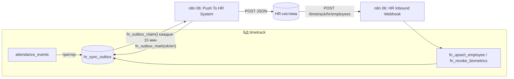

# Интеграция с HR-системами

Интеграция двусторонняя и не зависит от конкретной HR-системы: наружу события уходят через **outbox** (гарантированная доставка), внутрь справочник сотрудников приходит одним вебхуком.



## Исходящие события (outbox → HR)

Каждое событие отправляется `POST` на адрес из ноды *Config* (`hrSystemUrl`) с аутентификацией из credential **HR System API** (Header Auth, например `Authorization: Bearer …`).

```json
{
  "id": 1024,
  "kind": "attendance.created",
  "entity_type": "attendance_event",
  "entity_id": "42",
  "created_at": "2026-09-21T06:05:12.4Z",
  "attempt": 1,
  "data": {
    "event_id": 42, "employee_id": "EMP-001", "event_type": "check_in",
    "occurred_at": "2026-09-21T06:05:12.311Z", "source": "face", "status": "valid",
    "superseded_by": null, "device_id": "kiosk-1", "location": "Проходная"
  }
}
```

| `kind` | Когда | `data` |
|---|---|---|
| `attendance.created` | новое событие (лицо, ручная отметка, одобренная корректировка) | событие |
| `attendance.updated` | событие помечено `corrected`/`voided` | событие с `status`, `superseded_by` |
| `employee.upserted` | изменение карточки сотрудника | `employee_id`, `status`, `hr_external_id` |
| `consent.revoked` | отзыв согласия/удаление биометрии | `employee_id`, `reason` |
| `absence.upserted` | создано, изменено или отменено отсутствие | запись `absences` целиком |

Семантика доставки — «хотя бы один раз»: приёмник должен быть идемпотентным по `id` (или по `entity_id` + `kind`). Ответ `2xx` — успех; иначе повтор с паузой 2, 4, 8 … минут (макс. 6 ч), после 10 попыток запись получает статус `dead` и требует внимания (`SELECT * FROM timetrack.hr_sync_outbox WHERE status = 'dead'`).

### Адаптация под конкретную систему

Замените ноду *Push To HR System* (или добавьте ноду *Code* перед ней) на нужный формат:

* **1С:ЗУП / Битрикс24 / Personio / BambooHR / SAP SuccessFactors** — HTTP-запрос к их API или готовая нода n8n (BambooHR, Personio есть в n8n); маппинг полей — в выражении `jsonBody`.
* **Файловый обмен** — вместо HTTP: нода *Convert to File* (CSV/XLSX) + SFTP/S3 по расписанию; тогда `fn_outbox_mark` вызывается после успешной загрузки файла.
* **Очередь** (RabbitMQ/Kafka) — соответствующая нода n8n вместо HTTP.

## Входящая синхронизация справочника (HR → timetrack)

`POST /webhook/timetrack/hr/employees`, токен роли `system` или `hr` (см. [api.md](api.md)). Записи проходят через `fn_upsert_employee` — новые создаются, существующие обновляются (пустые поля не затирают текущие значения). Увольнение (`status: terminated`) фиксирует `terminated_at`; биометрия удаляется воркфлоу 07 через `daysAfterTermination` дней.

Идентификатор сотрудника `employee_id` — общий ключ систем; если в HR-системе другой формат, сохраняйте её ключ в `hr_external_id`.

### Отсутствия и производственный календарь

Кадровые приказы (отпуск, больничный, командировка) и производственный календарь приходят теми же двумя вебхуками:

* `POST /webhook/timetrack/hr/absences` — `{ "absences": [ { employee_id, type, date_from, date_to, status, external_id, comment } ] }`
* `POST /webhook/timetrack/hr/calendar` — `{ "calendar_code": "ru", "days": [ { day, day_type, shorten_minutes, name } ] }`

Формат и семантика полей — в [api.md](api.md). Обе операции идемпотентны, поэтому HR-система может слать полный срез хоть каждую ночь. Практика внедрения: отсутствия синхронизировать ежедневно (ночью и после утверждения приказа), календарь — раз в год при публикации и после каждого изменения переносов.

Если кадровый учёт ведётся в той же системе, что и табель, отсутствия можно заводить напрямую: `SELECT * FROM timetrack.fn_upsert_absence('EMP-002', 'vacation', '2026-09-21', '2026-09-25');`

## Импорт исторических данных

`INSERT INTO timetrack.attendance_events (employee_id, event_type, occurred_at, source) VALUES (…, 'import')` — события с `source = import` попадают в отчёты наравне с остальными и не запускают распознавание. Массовую загрузку удобно делать нодой Postgres (операция *Insert*) из CSV.
