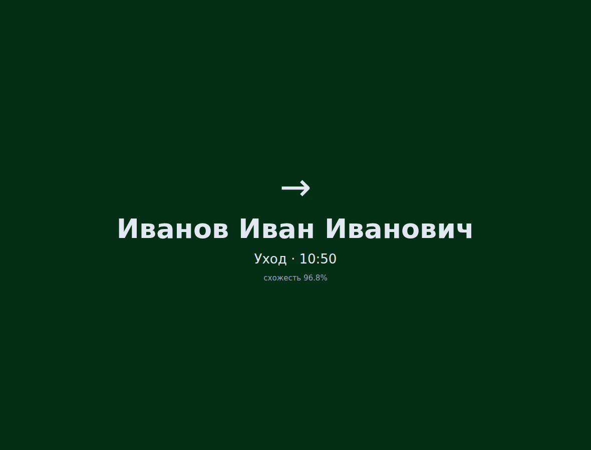
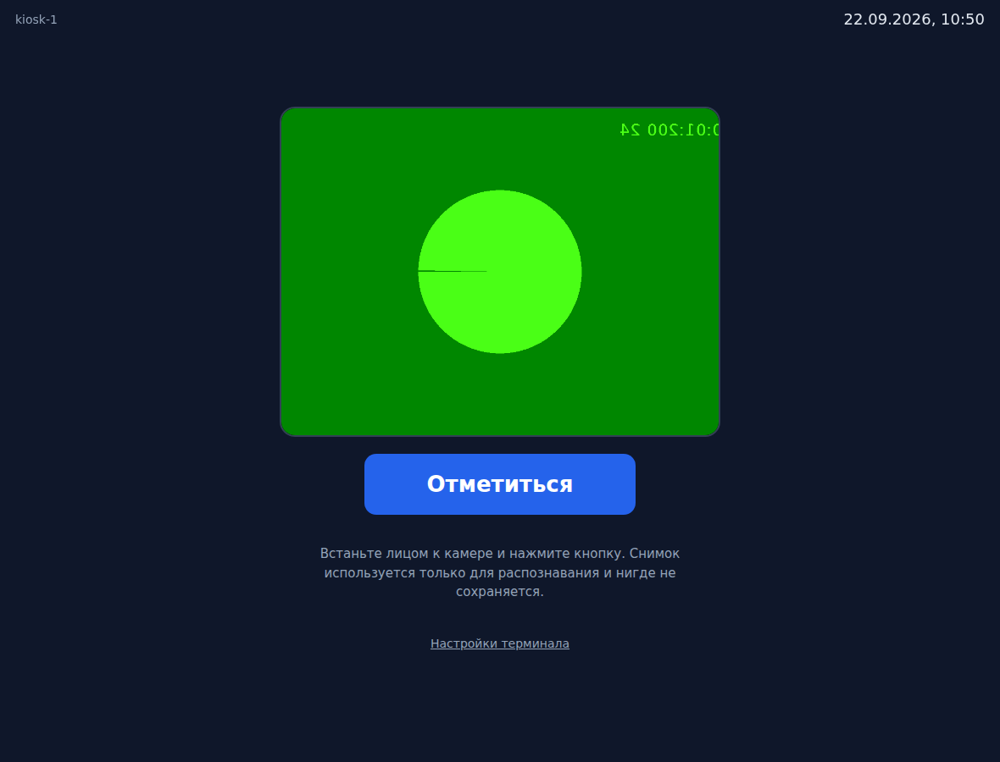
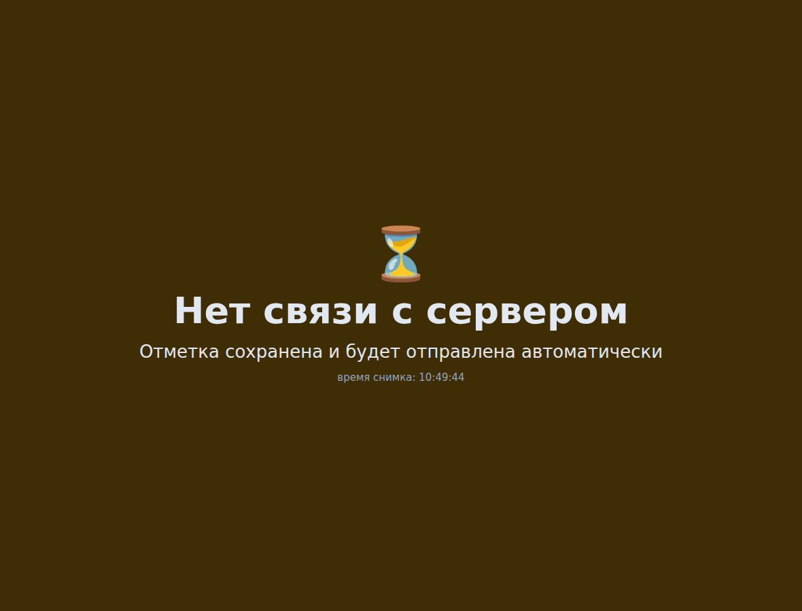
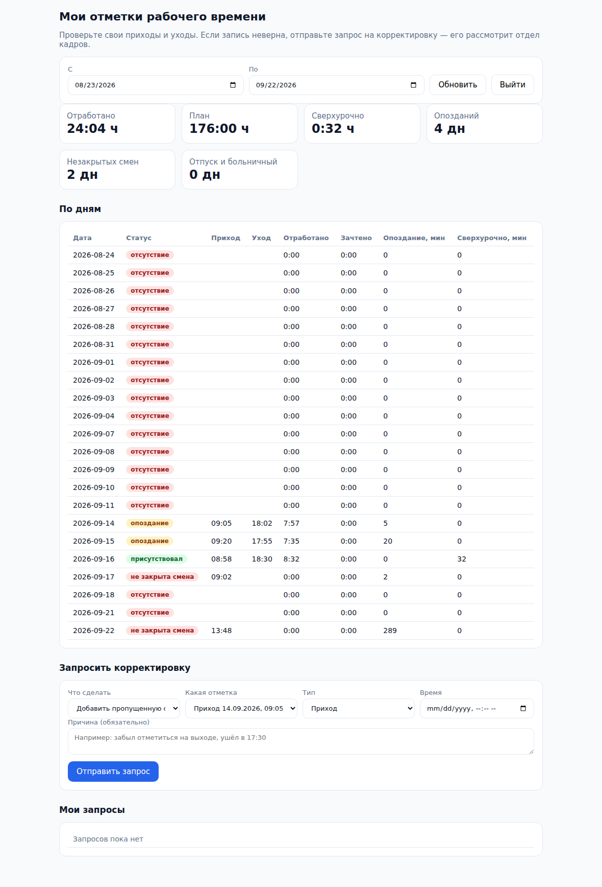
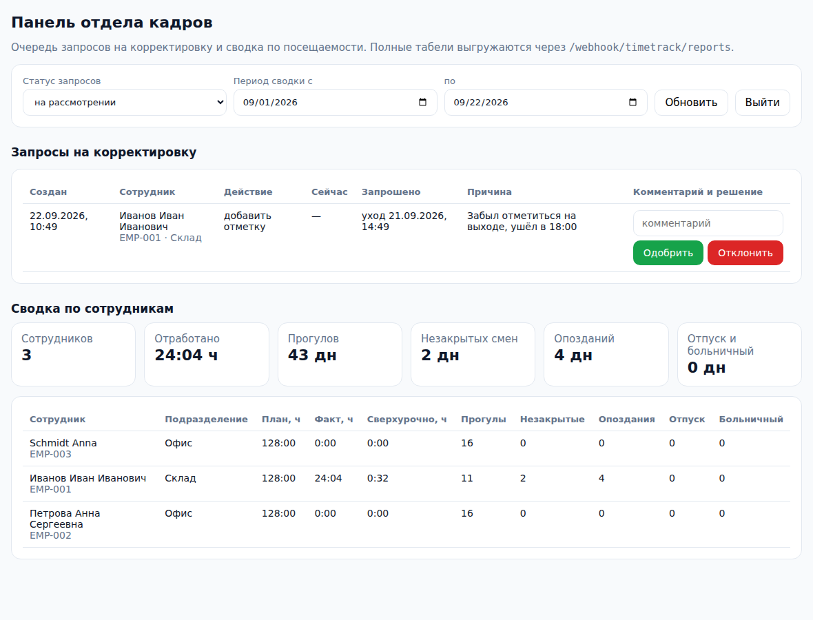

# Интерфейсы: терминал, личный кабинет, панель HR

Три самостоятельные HTML-страницы без сборки и зависимостей. Обращаются напрямую к вебхукам n8n, поэтому их можно положить на любой статический хостинг, в nginx рядом с n8n или открыть с флешки на планшете проходной.

| Файл | Для кого | Что делает |
|---|---|---|
| `kiosk.html` | терминал на проходной | снимок с камеры → `POST /webhook/timetrack/clock`, крупная карточка результата, офлайн-очередь |
| `employee.html` | сотрудник | свои дни и сессии (`GET /me/records`), запрос корректировки (`POST /me/corrections`), статусы запросов |
| `hr.html` | отдел кадров | очередь корректировок с кнопками «Одобрить» и «Отклонить», сводка по сотрудникам за период |



## Как запустить

1. Разместите файлы на любом HTTPS-хостинге (камера в браузере работает только по HTTPS или на `localhost`).
2. Откройте страницу, введите адрес n8n и токен: терминалу нужен токен роли `device`, сотруднику — `employee`, кадровику — `hr`. Токены выпускаются в БД: `SELECT timetrack.fn_issue_token('Kiosk 1', 'device', NULL, 'Проходная');`
3. Настройки и токен хранятся в `localStorage` этого браузера и никуда не отправляются, кроме заголовка `X-Api-Token` при запросах к n8n.

Если страницы лежат на другом домене, чем n8n, укажите этот домен в ноде Webhook → Options → Allowed Origins (по умолчанию `*`; n8n сам отвечает на preflight-запросы браузера и пропускает заголовок `X-Api-Token`).

## Терминал: что важно знать

* **Снимок не сохраняется в системе.** Кадр из `<video>` кодируется в JPEG и уходит в запрос; ни база учёта, ни сервис распознавания его не хранят. Единственное исключение — офлайн-очередь: при отсутствии связи снимок временно лежит в `localStorage` этого терминала до успешной отправки (см. ниже).
* **Идемпотентность.** На каждый снимок генерируется `request_id`, который переиспользуется при повторной отправке — сервер ответит «дубликат», а не создаст вторую отметку.
* **Офлайн-очередь.** Если сети нет, отметка вместе со снимком и временем съёмки (`captured_at`) остаётся в `localStorage` этого терминала и отправляется автоматически при восстановлении связи (повтор каждые 20 секунд и по событию `online`). Запись удаляется сразу после ответа сервера; глубина очереди — 50 отметок. Токен в записи не хранится: он берётся из настроек в момент отправки. Терминал стоит в контролируемом помещении, но помните, что при долгом отсутствии связи на нём лежат биометрические снимки — это стоит отразить в уведомлении работникам. Окно приёма «задним числом» задаётся в воркфлоу 02 (`maxBackdateHours`, по умолчанию 24 часа) — при большей задержке событие запишется текущим временем и будет помечено в метаданных.
* **Ответы пользователю.** Коды ошибок переведены в понятные фразы: лицо не найдено, лицо не распознано, нет согласия на биометрию, сервис распознавания недоступен и т. д.
* **Управление.** Кнопка, пробел или Enter — сделать отметку. Ссылка «Настройки терминала» — адрес, токен, идентификатор устройства, место и режим (авточередование, только приход, только уход).

## Локальный запуск без n8n

Для вёрстки и демонстрации есть `dev-server.mjs`: он повторяет контракты вебхуков воркфлоу 02, 03 и 04 поверх настоящей БД (те же токены, те же функции `timetrack.fn_*`, те же коды ответов), а распознавание лица заглушено.

```bash
DATABASE_URL=postgres://postgres@127.0.0.1:5432/timetrack node ui/dev-server.mjs
# открыть http://localhost:8099/kiosk.html
```

Это инструмент разработки, а не продакшен-путь: в бою страницы обращаются к n8n, где снимок уходит в CompreFace.

## Снимки экранов

| | |
|---|---|
|  |  |
|  |  |

Снимки сделаны на реальном прогоне: страница → dev-сервер → PostgreSQL с демо-данными.

## Чего в страницах намеренно нет

* **Детекции живости** (защиты от фотографии на телефоне) — её даёт SDK терминала; оценка передаётся полем `liveness_score`.
* **Автоматического распознавания без нажатия** — кнопка избавляет от случайных срабатываний на прохожих; при необходимости добавляется детектор лица в кадре (`FaceDetector` или ONNX-модель) и авто-съёмка.
* **Постоянного хранения персональных данных в браузере** — кроме настроек терминала с токеном и временной офлайн-очереди отметок, страницы ничего не сохраняют.
